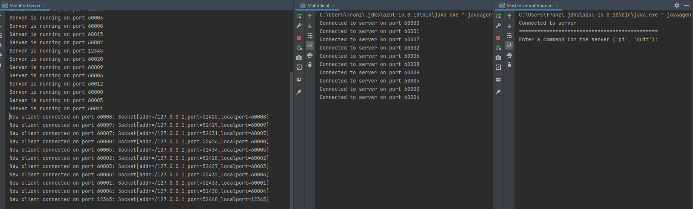
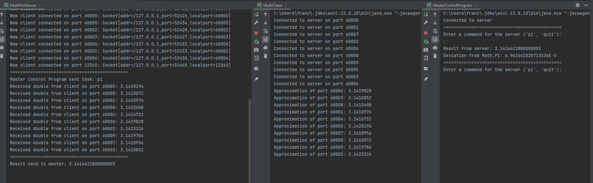
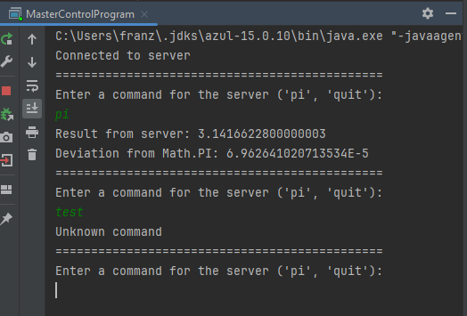
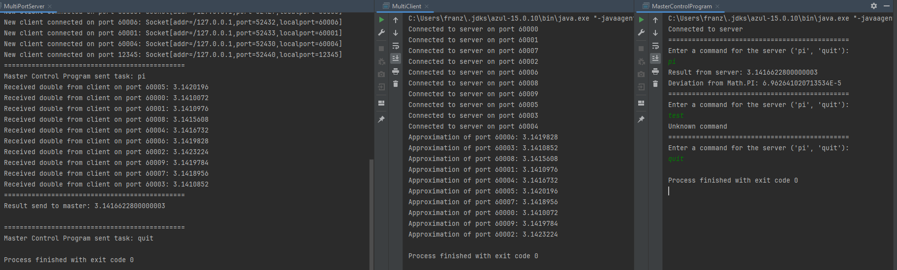

## Verteilte Berechnung von Pi mithilfe von Monte Carlo - (Geschätzer Aufwand: 13)
### Definierte Anforderungen aus der Abschätzung:
- Server schickt Anfrage an mehrere Clients
- Clients berechnen einzeln eine Näherung mithilfe des Monte Carlo Verfahrens
- Ergebnis wird zurück an Server geschickt und zusammengerechnet ausgegeben

-> Steuerung über Master Control Program

### Workflow:
```
 +-----------------+
 |   Client        |
 +-----------------+
       |  |  Connects to server,
       |  |  Calculate approximation for PI
       |  |
 +-----------+   Sends commands
 |   Server  |<-------------------------------+
 +-----------+                                |
       |  |  Receives commands,               |
       |  |  Sends average result to MCP      |
 +------------------+                         |
 |  Master Control  |<------------------------+
 |     Program      |
 +------------------+
```

### Screenshots:
* Laufender Server bereits zur Connection:
  * Connection von mehreren Clients über ihren Port
  * Connection vom Master Control Program
  
* PI Command vom Master Control Program:
  * Command wird an Server weitergeleitet
  * MutliClients werden beauftragt, einzeln eine Näherung für PI zu Berechnen
  * Einzelergebnisse werden an den Server übertragen
  * Server bildet Durchschnitt -> an Master Control Program zurückgeschickt
  * Master Control Program gibt das geschickte Ergebnis aus mit der Abweichung zu PI
  
* Illegal Command vom Master Control Program:
  * von 'PI' and 'QUIT' abweichende Commands werden nicht an den Server weitergegeben
  
* Quit Command vom Master Control Program:
  * Quit Command wird an Server weitergeleitet
  * Server schickt Command an die verbundenen Clients weiter
  * Alle Prozesse beenden sich
  

### Besonderes Augenmerk:
* Code-Kommentare zum einfachen Verständnis
* Steuerung komplett über Master Control Program möglich, nachdem die Verbindungen hergestellt worden sind
* Master Control Program selbst weiß nichts über die Einzelberechnungen (schickt Anfrage und bekommt einen Wert vom Server zurück)

### Ausführung des Projekts:
* MultiServer starten
* MultiClient starten
* MasterControlProgram starten
* gewünschter Command im Terminal vom MasterControlProgram eingeben